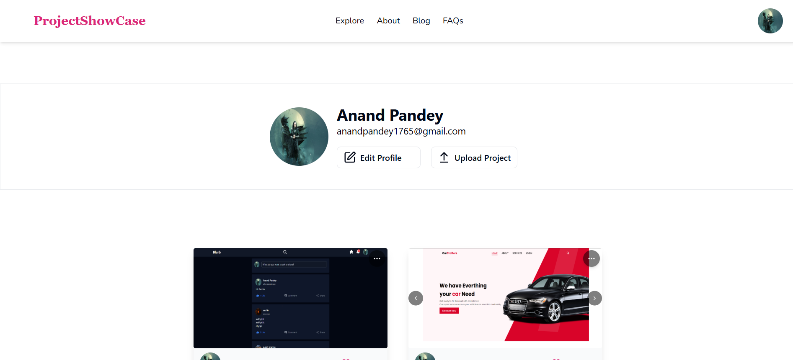
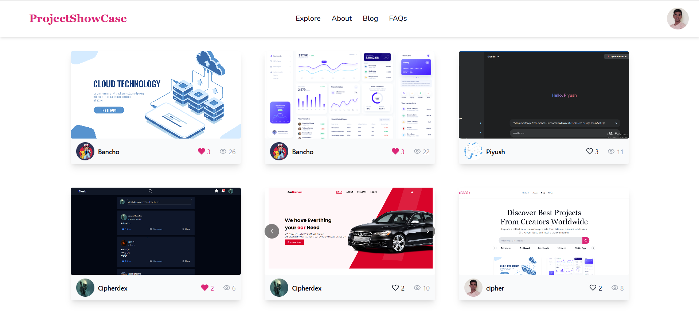
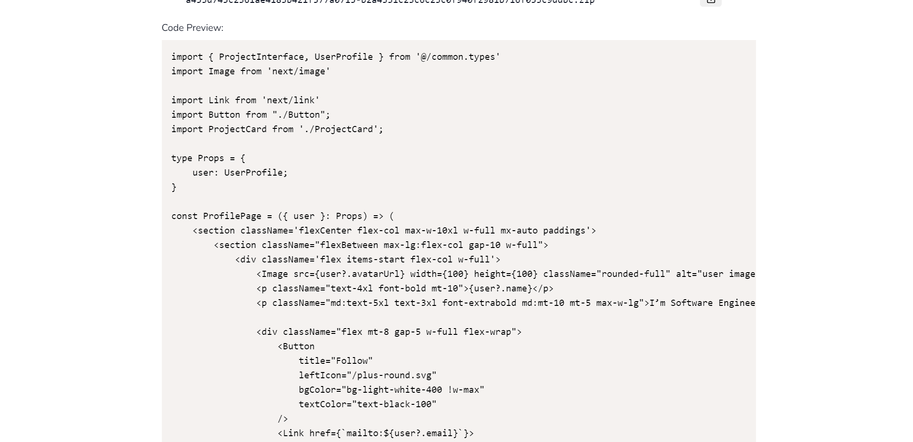
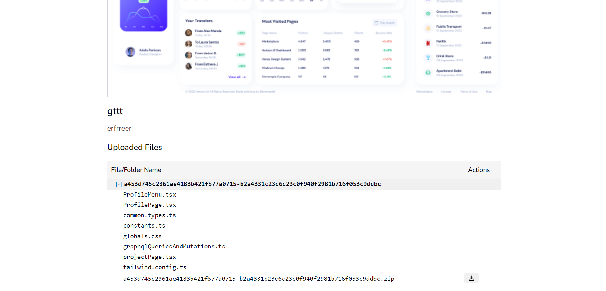

# A Showcase

A Showcase is a creative platform where users can upload and share their projects, including both frontend and backend work. Whether you're a designer, developer, or creative enthusiast, A Showcase provides a space to display your projects, showcase your skills, and connect with the community.

## Features

- **User Profiles:** Create and manage your personal profile.
- **Project Upload:** Upload your projects with thumbnails and source code.
- **View Source Code:** Users can view the source code of projects directly on the platform.
- **Project Showcase:** View and interact with projects shared by other users.
- **Feedback and Interaction:** Like and engage with the projects in the community.
- **Search Functionality:** Easily search for projects by keywords, tags, or categories.
- **Responsive Design:** Fully responsive platform for desktop, tablet, and mobile.

## Tech Stack

- **Frontend:** React.js, Tailwind CSS
- **Backend:** Node.js, Express.js
- **Database:** MongoDB
- **Authentication:** JWT (JSON Web Tokens)
- **Image Upload:** Multer

## Screenshots

### Home Page

### User Profile

### All Projects

### View Source Code

### Project Upload

## Known Issues

- **Hosting Issue:**  
  After hosting the application, there is an issue in fetching data from the backend, which causes some features to malfunction (e.g., data not rendering properly). This issue does not occur in the local development environment, where the application works as expected.  
  **Potential Cause:** Misconfiguration in the API endpoints or CORS settings during deployment.  
  **Workaround:** Ensure that the API endpoints are correctly configured for the hosting environment. Double-check CORS policies and server configurations.

---

