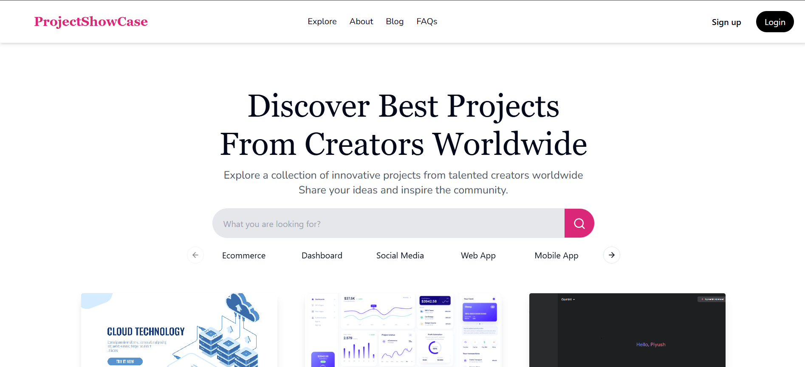

# A Showcase

A Showcase is a creative platform where users can upload and share their projects, including both frontend and backend work. Whether you're a designer, developer, or creative enthusiast, A Showcase provides a space to display your projects, showcase your skills, and connect with the community.

## Features

- **User Profiles:** Create and manage your personal profile.
- **Project Upload:** Upload your projects with thumbnails and source code.
- **View Source Code:** Users can view the source code of projects directly on the platform.
- **Project Showcase:** View and interact with projects shared by other users.
- **Feedback and Interaction:** Like and engage with the projects in the community.
- **Search Functionality:** Easily search for projects by keywords, tags, or categories.
- **Responsive Design:** Fully responsive platform for desktop, tablet, and mobile.

## Tech Stack

- **Frontend:** React.js, Tailwind CSS
- **Backend:** Node.js, Express.js
- **Database:** MongoDB
- **Authentication:** JWT (JSON Web Tokens)
- **Image Upload:** Multer

## Screenshots

### Home Page


### User Profile


### Project Upload


### View Source Code


> Replace `frontend/public/source-code.png` with the actual path to your screenshot for the "View Source Code" feature.

## Installation

### Clone the repository

```bash
git clone https://github.com/your-username/a-showcase.git
cd a-showcase
